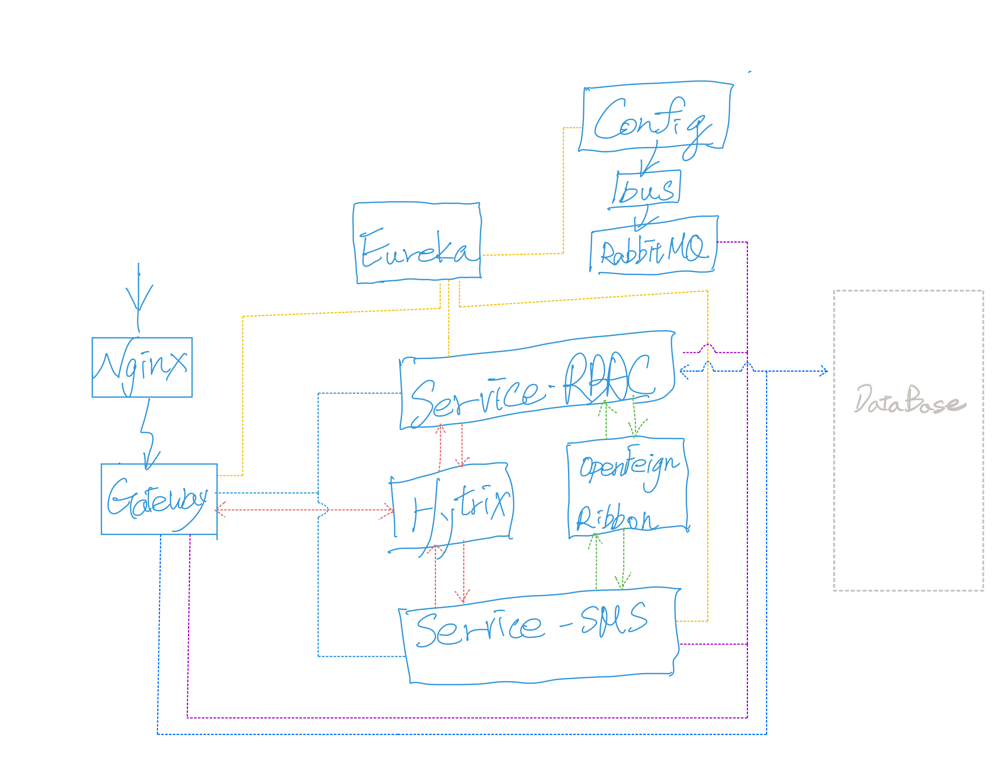
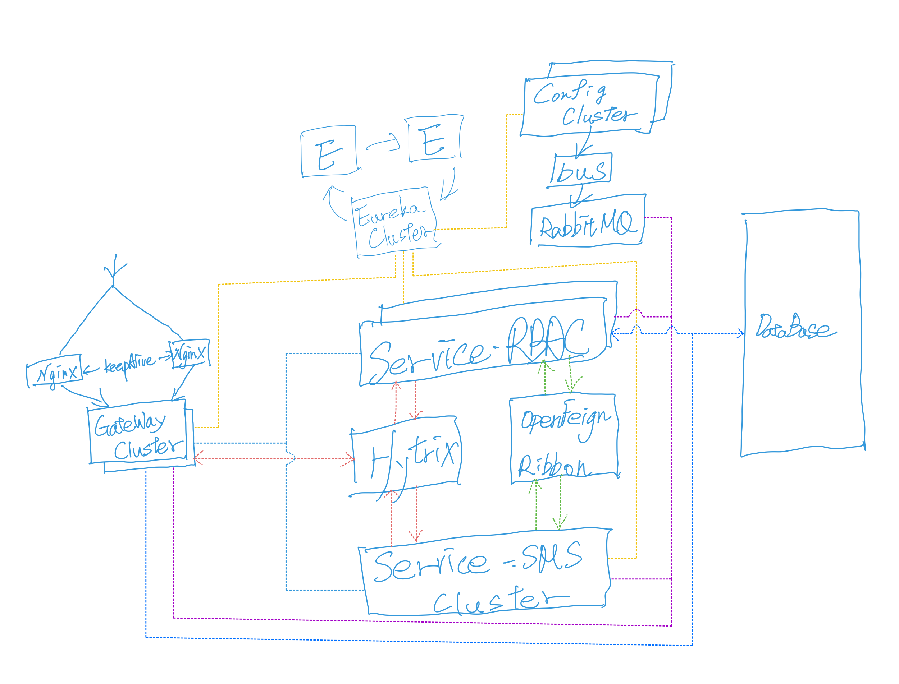
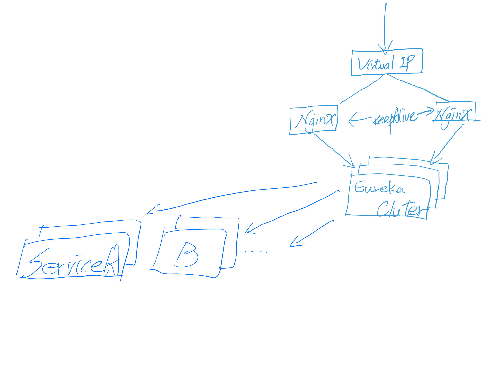

# SpringCloud-Nginx-Eureka-Config-Bus-RabbitMQ-Hystrix-Turbine-Gateway-DockerCompose

<br>
<br>

### Structure



<br>
<br>
<br>
<br>

### Execute
```
cd SpringCloud-Nginx-Eureka-Config-Bus-RabbitMQ-Hystrix-Turbine-Gateway-DockerCompose    (Folder)
```
```
docker-compose up -d
```

<br>
<br>
<br>
<br>

### Feature

| Dependency | Version |
| :----: | :----: |
| Spring Boot | 2.2.5.RELEASE |
| Spring Cloud | Hoxton.SR3 |
| Spring Eureka | by parent version |
| Spring Config | / |
| Spring Bus Amqp| / |
| Spring Hytrix | / |
| Spring Hystrix Dashboard | / |
| Spring Turbine | / |
| Spring Actuator | / |
| SpringCloud Gateway | 2.2.2.RELEASE |
| RabbitMQ | 3.8.3 |
| Docker| v20.10.10 |

<br>
<br>
<br>
<br>

### Api

| api | Service |
| :----: | :----: |
| localhost:80 | Nginx |
| /rbac | Service-RBAC |
| /rbac/sms | RBAC -> SMS(/sms/send)) |
| /config/test | Config 刷新測試參數 |
| /rbac/breaker | 方法熔斷測試 |
| /rbac/breaker/yml | 全域配置熔斷測試 |
|  |  |
| /sms | Service-SMS |
| /sms/test | Config 刷新測試參數 |
| /sms/send | RBAC -> SMS(/sms/send)) |
|  |  |
| /config/test | Config 刷新測試參數 |
| /gateway/breaker | 全域配置熔斷測試 |
|  |  |
| localhost:8761/eureka/ | Eureka DashBoard |
| localhost:8761/eureka/actuator/health | Eureka Actuator |
| localhost:8772/hystrix | Hystrix DashBoard<br>http://turbine:8773/turbine.stream |
|  |  |
| localhost:8771/actuator/bus-refresh | 多服務 Config 刷新測試 |
| localhost:15672 | RabbitMQ Management |
| localhost:8401 | not allow |
| localhost:8402 | not allow |
| localhost:18650 | not allow |

<br>
<br>
<br>
<br>

### Troubleshooting

| Trouble | solve |
| :----: | :----: |
| Docker depend on 並未會真正等到伺服器運作 | 寫一個 wait-for-it bash 控制，<br>並把 ENTRYPOINT 改至 docker-compose command。 |  

<br>
<br>
<br>
<br>

## Best Further
1. Config Cluster with Spring security
2. Eureka Cluster with Spring security
3. Nginx with keepAlive 

